# 2021-Wrap-Up
## 2021 Wrap-Up - Good Deeds, Small Achievements and Failures...

## January 2021
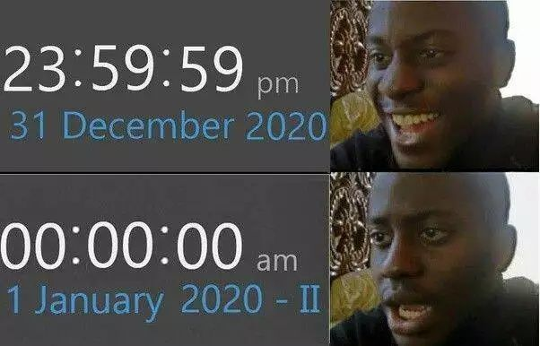
* Became the 1st __GitHub Expert__ from my university, and worked out with various communities in and around the University campus 
* Participated in __EY TECHATHON'21__ and stood in Top 25 teams, for developing an efficient method of COVID-19 Vaccine Distribution backed by Data and AI 
* Proposed Thesis for SOTA Image processing Algorithm for Facial Recognition and submitted 2 Research Papers for Review. 
* Decided to Participate in GSOC'2021, but couldn't give enough time due to Project work and research work. 

## February 2021

* Tried my hands on __GATE Exam__, couldn't get the expected results.
* Judged my First MLH Hackathon - __MLHHACKS Hack Surrey Virtual__
* Won __MLH KU Hackfest__ - Best use of GitHub Student Dev Pack
* Got My 1st full-time offer
* Selected in __ASEAN Hackathon__ to represent India, after winning SIH 20, but couldn't participate due to health issue
* Decided to increase CodeChef Practice Frequency, but couldn't execute the plan

## March 2021
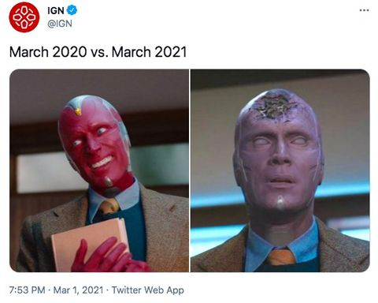
* Won __MLH SF HACKS__ - Best Use of Microsoft API
* Attended __GitHub Satellite India__ as a GCE
* Submitted Research Project Report for Major Project
* Got my hands dirty on Prometheus, Jenkins, DataDog, Serverless Functions
* Started working with __NVIDIA JETSON NANO__
* Gave a Talk on "How to Use GitHub Student Developer Pack Like a Pro"
* Although all set for MLH fellowship, I couldn't crack it possibly because of a great yet messy code repository. 

## April 2021
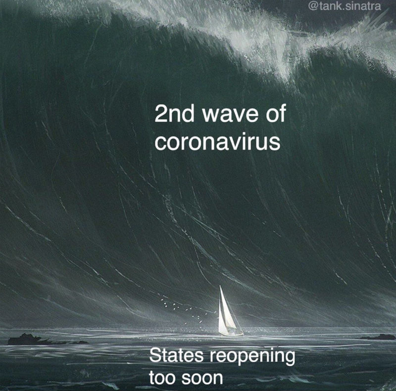
* Got my hands dirty on Edge Devices, Lite ML Models and ONNX
* Worked around Azure IoT Hub, TensorRT, TFlite, Pytorch
* Worked around with l4t Docker
* Deployed my SOTA Face Recognition Algorithm on NVIDIA JETSON NANO for public use.
* Overcame my imposter syndrome and depression period, which I faced due to the opportunities I missed in the past.
* Started a Strict Workout and Diet Plan
* Remembering that __SciPy__ and thus opensource went to MARS

## May 2021
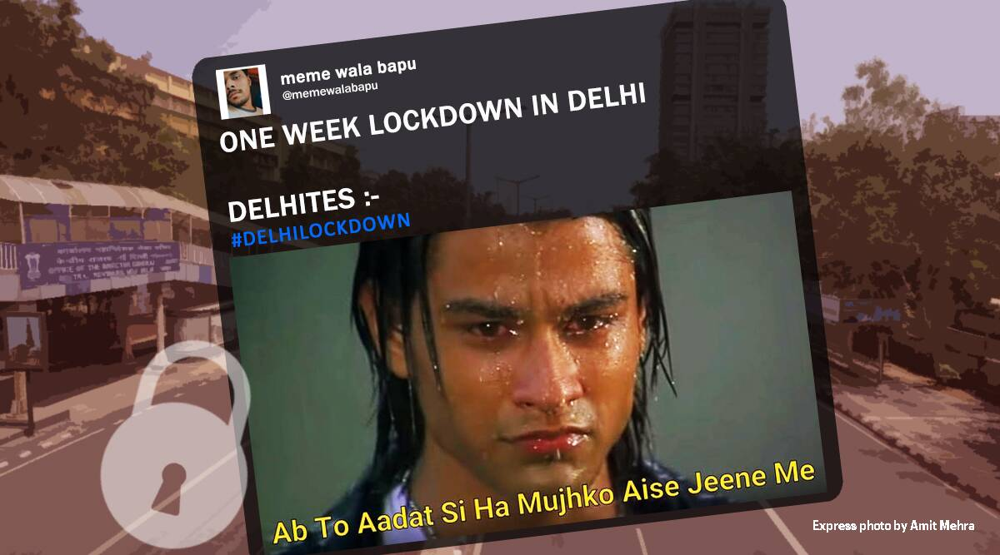
* Got My 1st Dose of Vaccine
* Taught DSC communities members about ML Edge Processing
* Participated in __DELL UNBOUNDED ANGEL HACKS__, although we didn't get a  great position, Learnt a lot about RUST, JAVA, PRAVEGA, KAFKA
* Gave Final Semester Exams, Practicals
* Defended my Research Major Project for 8th Sem
* India Lost many great and loved souls, Including Mr. Shakti Goaps founder Devfolioco
* India stood still in the last week of April when the Second wave shook the entire country. I am glad I was involved in helping people in need on Twitter, Facebook, and LinkedIn throughout the month  (Apr 21 - May 30). *Wishing all the affected families and readers a very happy 2022*.

## June 2021
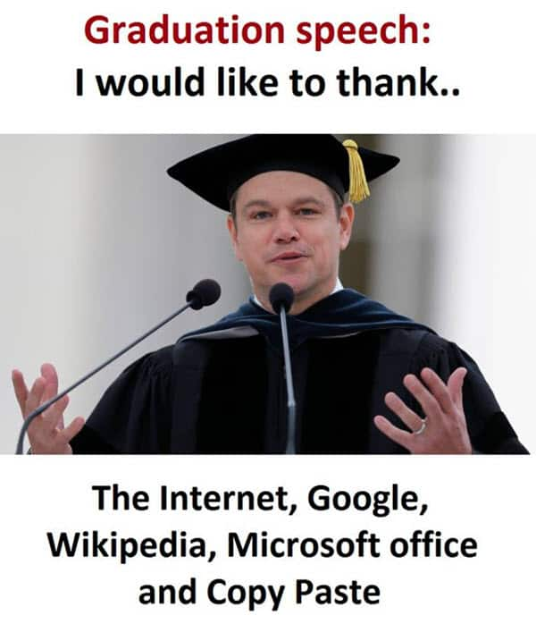
* __Graduated__ My Bachelors with 8.5 GPA Score
* Concluded my role as DSC UIET KUK Mentor
* Started my Intern as Backend Dev at __Zopper - A Phonepe Company__
* Got my Hands dirty on Django, Redis, Celery, Apache Spark and MongoDB
* Learnt Monitoring with Zabbix, Graylog, Sentry
* Donated Blood Plasma, as India was recovering from 2nd strike of COVID-19
* Replaced VSCode with Pycharm completely
* Revisited Kubernetes and Docker concepts
* Got Featured in GitHub Graduation 2021 virtual Event
* 4th Episode of Hello Engineers was aired.
* Decided to Participate in __KAGGLE Hackathons__, to brushup ML skills, but couldn't execute the plan well

## July 2021
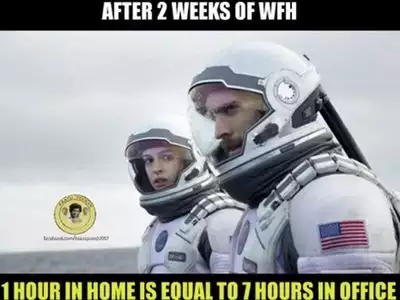
* Worked around with JS, RUST and JAVA
* Revisited mathematical concepts of ML and computer vision
* Participated in ComputerVision -AI Team @Zopper
* Revisited concepts of __Blockchain Tech__
* Learnt AWS - EC2
* Started Using GitHub co-pilots
* Bought a Laptop and new phone with my own salary

## August 2021
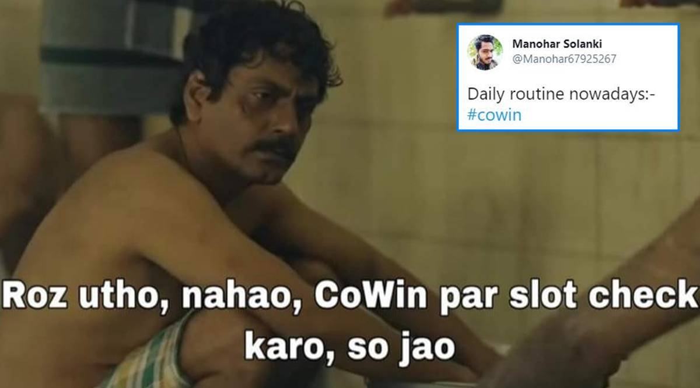
* Joined __Wipro__ as Project Engineer - Data Analytics and AI
* Started Learning Informatica, Abinitio, Flutter, Scala
* Was involved In KT, Training and Learning new tech
* Followed Olympics
* Started Writing Shayari
* Got __fully vaccinated__
* Planned to Host a Hackathon, But couldn't execute the plan well.

## September 2021
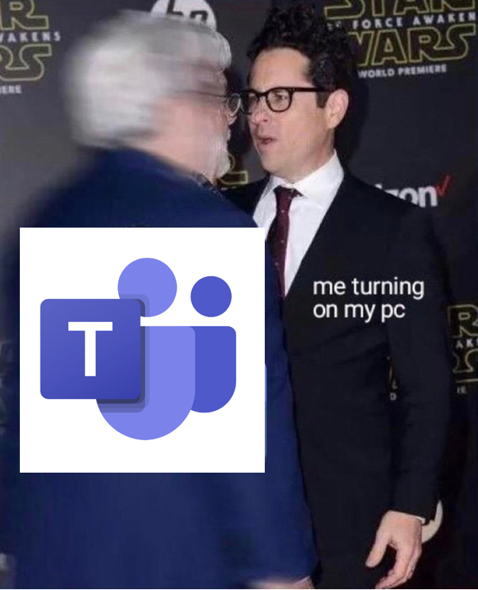
* Got Promoted to __TURBO Profile and Data Engineer Role__
* Revisited concepts of Abinitio and Informatica
* Submitted Revisions for my research papers
* Started __IELTS__ Preparation
* Worked around with JULIA and ML

## October 2021
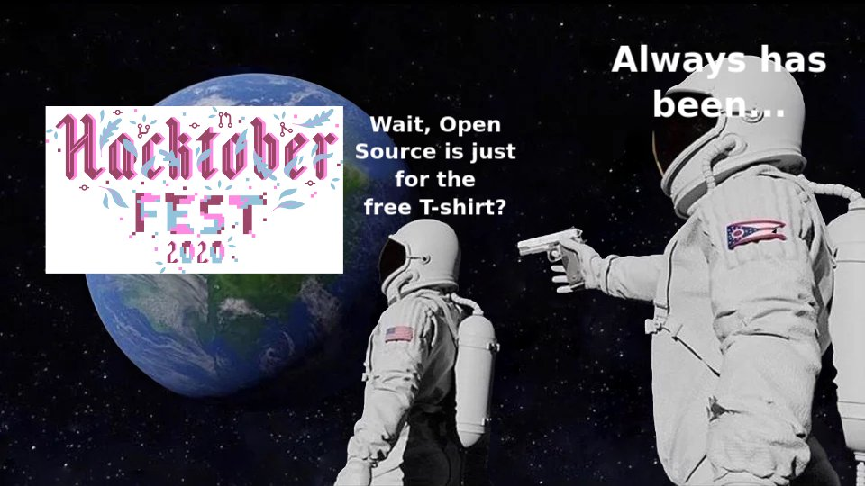
* Scored 8 Band score in __IELTS__
* Started Exploring Web 3 workspace, Blockchain Development
* Started Investing in Crypto and NFT
* Lost around 15 kgs of weight, Back in shape :)
* Failed to participate in __HacktoberFest'21__ due to Company Tasks

## November 2021
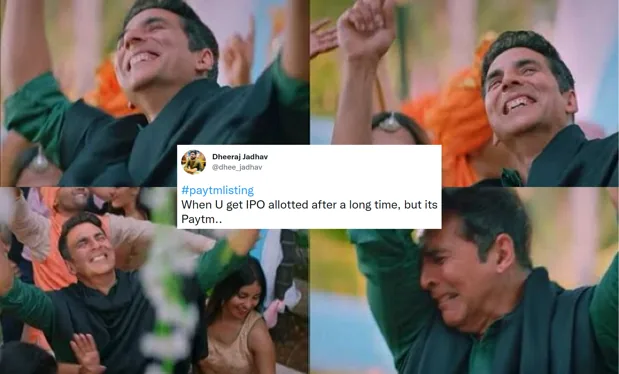
* Wrote a Micro-blog on "How Diwali and Christmas Lights work"
* Bought my first IPO for NYKAA and PAYTM
* Started working out for GSOC 2022
* Started working out for My Master's Application
* Explored Web 3 workspace, Blockchain Development
* Started working on SHATRANJ  - A chess DApp for __POLYGON BUIDL IT Hackathon__
* Shifted to Body-Weight Workout with the inclusion of Bhangra
* Learnt about __Bitcoin Mining__ - Ready to do some Hands-on:)

## December 2021
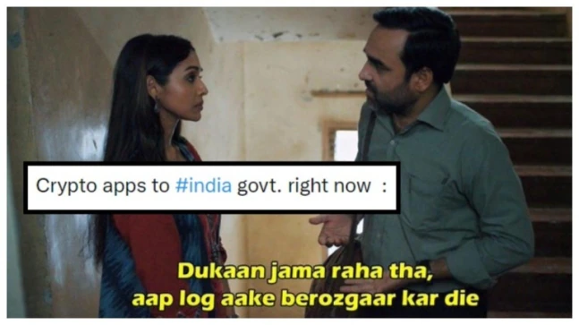
* __Kisaan-Andolan__ finally ended on a happy note. I supported the cause from tits beginning in 2020, and was really happy on 11 December 2021.
* Learnt Solidity
* Learnt about MORALIS Rpc, POLYGON MAINNET and POLYGON MUMBAI
* Learnt about Filecoin, StackOS, Covalent, METAMASK
* Developed my own CryptoToken $ASHF
* Learnt about Decentralised Application, Decentralised Servers, Decentralised Databases. 
* Learnt and Implemented IPFS with Python
* Learnt and Implemented SSE server with Python
* Learnt and Implemented Socket.io with Python
* Reworked on $ASHF and developed $ASHFx with __Superfluid__
* Won Award for using SuperFluid in Shatranj in __POLYGON BUIDL IT__ 
* In the Process of converting my shaayri to NFT and investing in Health, mental peace, skill set and crypto.

